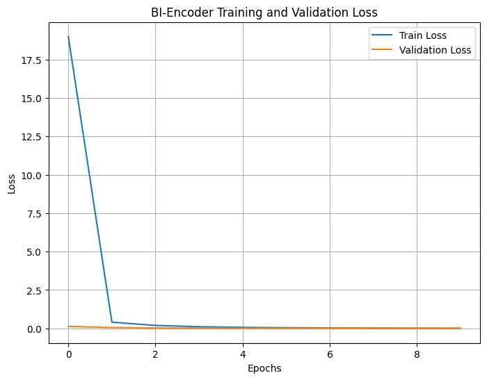
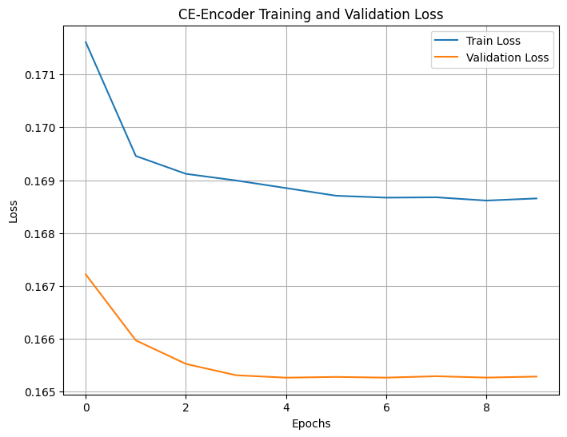
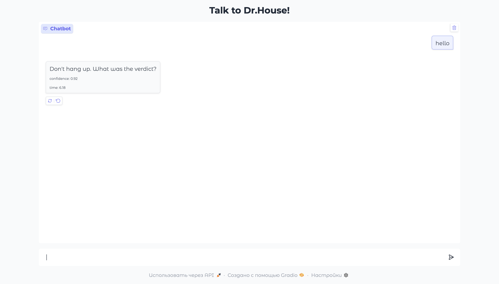
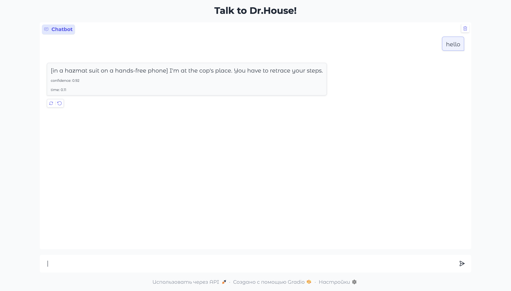
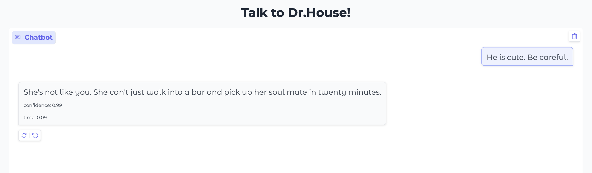
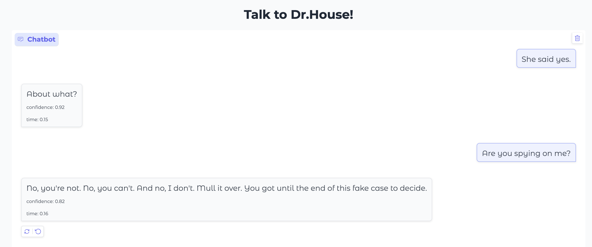
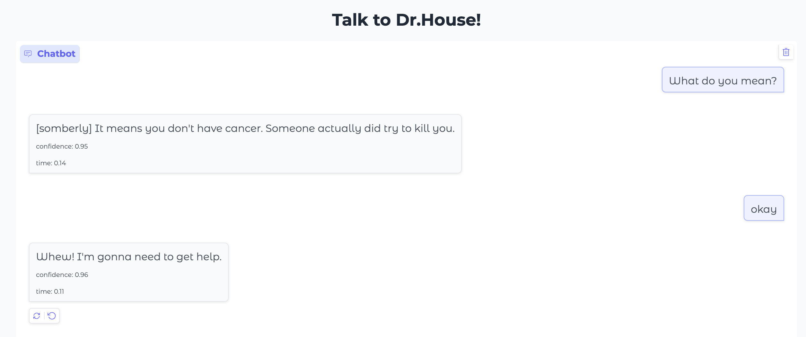

# Отчет по Разработке Retrieval-Based чат-бота
Чат бот выбирет подходящий подходящий ответ доктора Хауса на основе его реплик из сериала. Решение работает на связке BI-Enoder + Cross-Encoder. Первый извлекает k кандидатов, второй используется как reranker

- [Обучающий датасет](https://huggingface.co/datasets/sentence-transformers/all-nli ) (для BI - pair-class, для CE - pair-score)
- web-сервис реализован с gradio

Ссылка на модели: https://drive.google.com/drive/folders/1_RREG35e9KJzcL7RxqLkgzRK9zqvX6U2?usp=sharing 
Ссылка на подготовленные данные: https://drive.google.com/drive/folders/1s3nZC_HuUI6sSOHGmkAdtdxKP6Cdw2ZP?usp=sharing

## Запуск
Зависимости `pip install -r requrements.txt`
В командной строке ввести `python3.11 gradio_interface.py`

## Графики обучения
### BI Encoder - последняя версия
Кажется, что к 10 эпохе train и val лоссы сошлись, но на самом деле потери постепенно уменьшались, просто разница небольшая

### BI Encoder - первая версия (бейзлайн)

### Cross Encoder - последняя версия

## Ускорение инференса 
Нужно было не только ускорить инференс, но и вместить все 17к+ реплик в оперативную память. Поэтому первый шаг в ускорении - это предвычисленные эмбеддинги в BI енкодере

Второй шаг - добавление faiss индекса. 
Примерное время обработки без faiss ~= 6сек, с ним ~=0.2сек
### Скрин работы модели без Faiss

### Скрин работы модели с Faiss

### Еще примеры реплик

